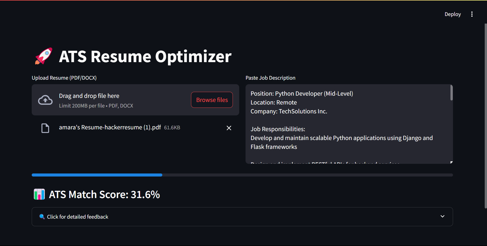

# 🚀 ATS Resume Optimizer  

Beat Applicant Tracking Systems (ATS) with AI-powered resume analysis.  

  

## ✨ Features  
- 📊 ATS compatibility scoring  
- 🔍 Missing keyword detection  
- 💡 Improvement suggestions  
- 📁 PDF/DOCX support  

## 🛠️ Tech Stack  
- Python  
- Streamlit (UI)  
- spaCy (NLP)  
- PDFPlumber (PDF parsing)  

## 🚀 Quick Start  
1. Install dependencies:  
   ```bash
   pip install -r requirements.txt